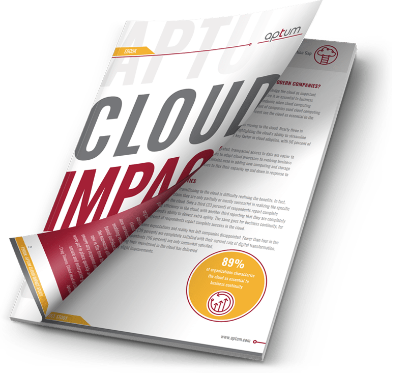

    <!-- hero -->
    

        

            

                

                    <h1 class="display-4">Ciel dégagé à l'horizon : éviter le chaos dans le cloud</h1>
                

            

        

    

    

        

            

                

                    <h2>Maîtrisez la complexité et la gestion des coûts du cloud pour une transformation numérique réussie</h2>
                    
La première partie de l'étude 2023 d'Aptum sur l'impact des nuages révèle que, bien que 98% des répondants soient satisfaits de la transformation vers le cloud de leur organisation, les défis liés à la gestion et à l'optimisation des dépenses cloud persistent. Mais qu'est-ce qui empêche les organisations d'atteindre leur plein potentiel dans le cloud ?

                    

L'étude souligne la nécessité pour les entreprises de prioriser les objectifs commerciaux et l'optimisation lors du déploiement des écosystèmes cloud. Avec des complexités comme l'intégration, la prévisibilité des coûts, les lacunes en matière de compétences et les changements technologiques affectant les environnements hybrides et multi-cloud, les organisations doivent adopter une approche stratégique pour gérer efficacement leur infrastructure cloud.

Ne manquez pas l'opportunité de découvrir les insights et les stratégies qui pourraient aider votre organisation à naviguer dans les complexités du cloud et à embrasser une transformation numérique réussie. 

<a href="https://aptum.com/cloud-hub/2023-cis-part-1" target="_blank">Cliquez ici pour télécharger</a> 

                

            

                

                
            

        

            

        

    

